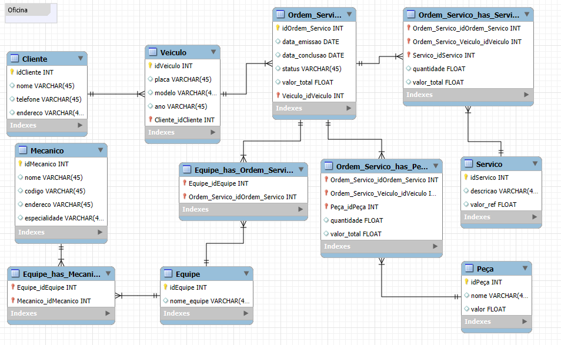

# Projeto Conceitual de Banco de Dados – Oficina

Este projeto foi desenvolvido como parte do desafio da **Digital Innovation One (DIO)** no bootcamp, com o objetivo de criar um modelo conceitual de banco de dados voltado para um sistema de oficina.

---

## 📌 Contexto

O modelo representa um sistema de oficina que gerencia **clientes, veículos, mecânicos, equipe, serviço, peça e ordem de serviço**.

O ponto de partida foi a narrativa disponibilizada no desafio.

Deste modelo foi gerado os scripts do schema e criado os inserts e queries conforme solicitado no desafio para atender a entrega.

---

## 📊 Modelo Conceitual

Abaixo está a representação do diagrama criado:

---

## 🚀 Como Utilizar

1. O diagrama foi construído no **MySQL Workbench**.  
2. O arquivo `.mwb` presente em '/workbench_diagram/diagram_oficina.mwb' pode ser aberto no Workbench para futuras alterações.  
3. Caso necessário, o modelo pode ser traduzido para **modelo lógico/físico (DDL SQL)**.  

---

## 🗃️ Queries para Entrega Desafio

**1️⃣ Quantas ordens de serviço cada cliente realizou?** → 
[Quantas Ordens por Cliente](./sql/query1.sql)

**2️⃣ Valor total gasto por cliente (atributo derivado)** → 
[Total por Cliente](./sql/query2.sql)

**3️⃣ Serviços mais realizados (filtrando por quantidade)** → 
[Serviços mais Realizados](./sql/query3.sql)

**4️⃣ Peças utilizadas em cada ordem de serviço** → 
[Peças em cada Ordem](./sql/query4.sql)

**5️⃣ Membros de cada equipe e ordens de serviço atribuídas** → 
[Membros Equipe e Ordem](./sql/query5.sql)

**6️⃣ Ordem de serviço com valor total derivado (soma de serviços + peças)** → 
[Ordem Valor Total](./sql/query6.sql)

---

## 🖥️ Executando o Banco
1. Abra o MySQL Workbench.
2. Execute o script `create_schema.sql` para criar o [schema](./sql/create_schema.sql).
3. Execute os [scripts de inserts](./sql/insert_values.sql).
4. Teste as queries listadas acima.

---

Desenvolvido como parte do bootcamp da [Digital Innovation One](https://www.dio.me/).
